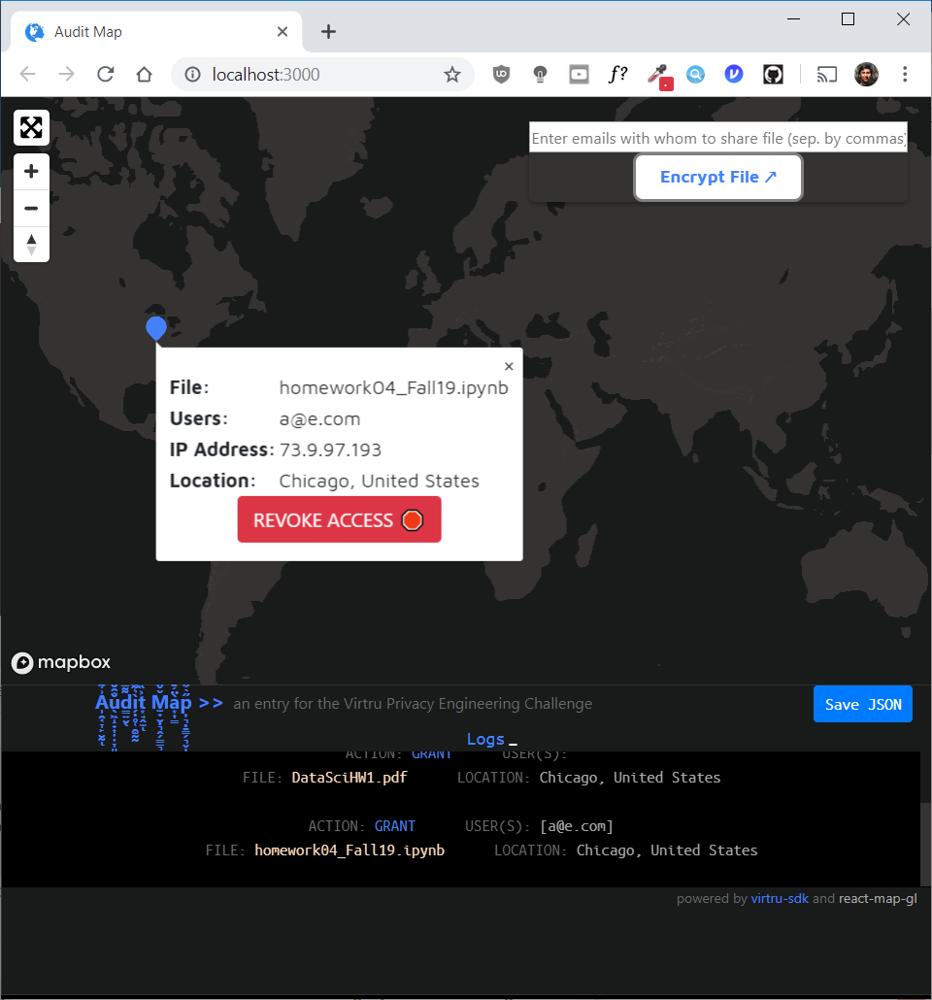

# Audit Map
[](https://travis-ci.org/suchak1/audit_map)
[](https://ubuntu.com/download/desktop)
[](https://ubuntu.com/download/desktop)
[](https://ubuntu.com/download/desktop)
[](LICENSE.md)
[](package.json)

#### an entry for the Virtru Privacy Engineering Challenge
***

Through the use of geolocation (specifically by mapping IP addresses that have accessed encrypted data to specific lat/long coordinates), we can visually pinpoint where bad actors access and send data. Thus, we can potentially halt the spread of sensitive information by simply revoking access directly on the map.

## Getting Started

### Prerequisites

Obtain a free API key from [*mapbox*](https://www.mapbox.com/)
- This will enable mapping services.

Obtain a free API key from [*virtru*](https://www.virtru.com/)
- This will enable encryption services and access to audit data.

Obtain a [free API key](https://ipstack.com/product) from [*ipstack*](https://ipstack.com).
- This will enable ip address to a geographic coordinate conversion (latitude / longitude).

Paste the email address associated with your Virtru API key as well as your other API keys in the [`.env`](.env) file as such:

```
    REACT_APP_EMAIL=...
    REACT_APP_MAPBOX=...
    REACT_APP_VIRTRU=...

    # Optional
    REACT_APP_IPSTACK=...
```

***Note:*** The use of an ipstack API key is optional. For convenience, if an [*ipstack*](https://ipstack.com) API key is not provided, Audit Map will use [*ipapi*](https://ipapi.co)'s service without an API key.

### Installation
**Linux**

To install the necessary packages, simply run:
```
    npm i
```


## Local Deployment

To use Audit Map, run:

```
    npm start
```

## Use Case
Link to [Video Demo](https://youtu.be/nS0DRyZIU4w).


1. Write email addresses (separated by commas) with which you would like to share an encrypted file in the text box in the top right.

2.  Click `Encrypt File` and save the encrypted file to your computer.

3. Click `Save JSON` and save the history of your actions. Make sure this new `history.json` file replaces the one in `src/`.

4. Inject an IP Grabber into the encrypted file by executing the following command in the main directory, where `link` is the IP Grabber link and `path` is the path to the encrypted file to track (the one you created in Step 2). [Obtain a link here.](https://grabify.link/image) Use the link under `New URL` for the `link` parameter in the command. Keep the tracking link under `Access Link`. Revisiting the Access Link will provide you ip addresses to use for Step 7.

    ```
        node inject grabber link path
    ```

5. Send the encrypted file by email or any other medium.

...

6. After someone else has opened the encrypted file, check the IP Grabber tracking link and collect the most recent IP address.

7. Inject the new IP address into our `history.json` file by executing the following command in the main directory, where `policyId`is a Virtru policy ID in `src/history.json` and `address` is the new ip address with which you would like to update the associated policy in `src/history.json`.

    ```
        node inject new_ip policyId address
    ```

8.  Check Audit Map again.

The markers on the map should be updated with new geographical coordinates corresponding with the new IP address you injected. You can now choose to revoke or grant access (after revoking) to the file based on the results of this IP addressing mapping.

## Result



## Files

- [```src/App.js```](src/App.js) - maintains state and acts as container for Map and Log components

- [```src/Map.js```](src/Map.js) - displays markers for encrypted files on world map, allows for granting and revoking access to encrypted files

- [```src/Log.js```](src/Log.js) - logs grant and revoke action history taken by user, allows saving of this history to maintain continuity between sessions

- [```src/ControlPanel.js```](src/ControlPanel.js) - contains button to encrypt a file and text box to choose users with which to share the encrypted file

- [```src/history.json```](src/history.json) - save file to store details for encrypted files

- [```.env```](.env) - credentials file

- [```packages.json```](package.json) - list of packages

- [```.travis.yml```](.travis.yml) - build pipeline


## License
This project is licensed under the MIT License - see the [LICENSE.md](LICENSE.md)
 file for details.

***

[](https://nodejs.org/en/)
