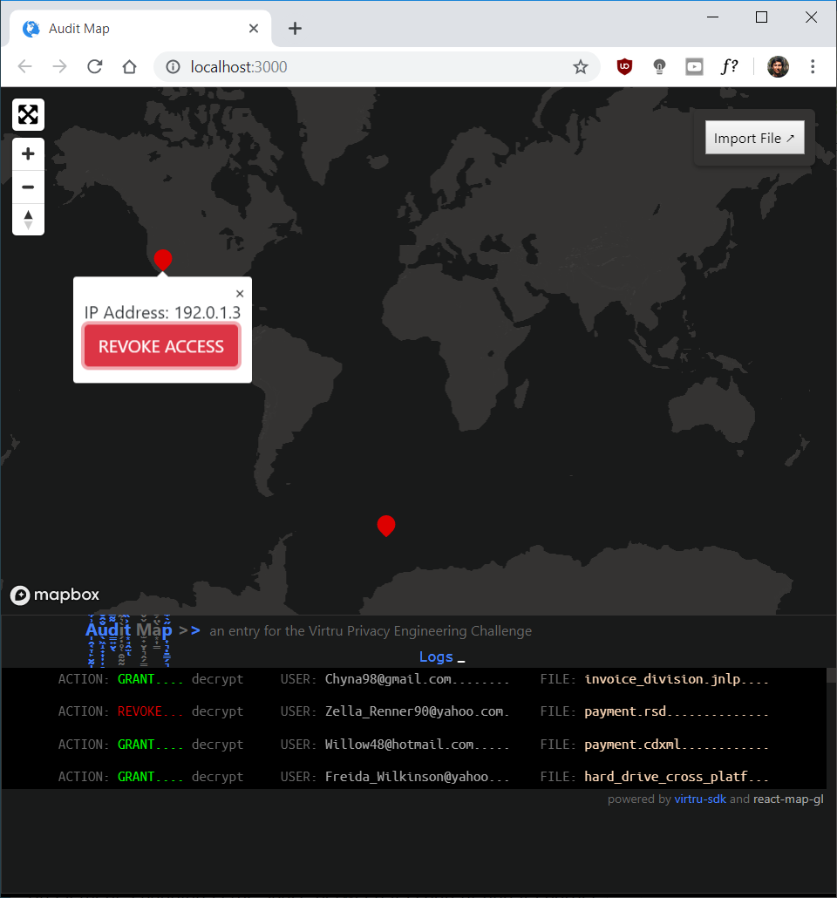

# Audit Map
[](https://travis-ci.org/suchak1/audit_map)
[](https://ubuntu.com/download/desktop)
[](https://ubuntu.com/download/desktop)
[](https://ubuntu.com/download/desktop)
[](LICENSE.md)
[](package.json)

#### an entry for the Virtru Privacy Engineering Challenge
***

Through the use of geolocation (specifically by mapping IP addresses that have accessed encrypted data to specific lat/long coordinates), we can visually pinpoint where bad actors access and send data. Thus, we can potentially halt the spread of sensitive information by simply revoking access directly on the map.

## Getting Started

### Prerequisites

Obtain a free api key from [*mapbox*](https://www.mapbox.com/)
- This will enable mapping services.


Obtain a [free api key](https://ipstack.com/product) from [*ipstack*](https://ipstack.com).
- This will enable ip address to a geographic coordinate conversion (latitude / longitude).

Obtain a free api key from [*virtru*](https://www.virtru.com/)
- This will enable encryption services and access to audit data.

Paste your api keys in the [`.env`](.env) file as such:

```
REACT_APP_MAPBOX=...
REACT_APP_IPSTACK=...
REACT_APP_VIRTRU=...
```

### Installation
**Linux**

To install the necessary packages, simply run:
```
npm ci
```

## Deployment

To use Audit Map, run:

```
npm start
```


## Result



## Files

- [```.env```](.env) - credentials file

- [```.travis.yml```](.travis.yml) - build pipeline


## TODO:
- Mapbox
  - state change should trigger file policy change (revoke, grant access)
  - change marker color based on row props data access
  - log should reflect state change
- Virtru SDK Integration
  - log should have fields for user, city, and filename - (perhaps time too)
  - app state should record date/time, city, ip address, geolocation, filename, user
  - handle file upload (Maven Pro font)
  - use access json data
  - add mock data
- Add Credentials
  - provide template for .env file
  - add travis-ci encrypted keys
- Surge Deployment

- new functionality: (greyed out "REVOKED" after REVOKE and then GRANT on second open)
- new functionality: loading button while sdk api calls are made

## License
This project is licensed under the MIT License - see the [LICENSE.md](LICENSE.md)
 file for details.

***

[](https://nodejs.org/en/)
